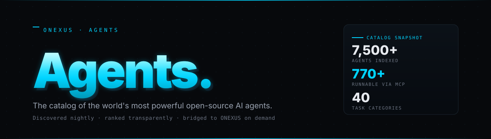

<div align="center">

<a href="https://onexus-agents.vercel.app"></a>

&nbsp;

<a href="https://onexus-agents.vercel.app"></a>
<a href="https://onexus-agents.vercel.app/runnable"></a>
<a href="https://onexus-agents.vercel.app/catalog"></a>
<a href="https://github.com/AllStreets/ONEXUS-Agents/blob/main/LICENSE"></a>
<br/>


&nbsp;

<p>
  <a href="https://onexus-agents.vercel.app"><strong>Live catalog →</strong></a>
  &nbsp;·&nbsp;
  <a href="https://onexus-agents.vercel.app/runnable"><strong>Runnable now →</strong></a>
  &nbsp;·&nbsp;
  <a href="https://onexus-agents.vercel.app/methodology"><strong>Methodology →</strong></a>
  &nbsp;·&nbsp;
  <a href="https://github.com/AllStreets/ONEXUS-Agents/issues/new?template=agent-submission.yml"><strong>Submit an agent →</strong></a>
</p>

</div>

---

## What this is

ONEXUS-Agents is the public, open-source arm of [ONEXUS](https://github.com/AllStreets/ONEXUS) — the agentic OS kernel.

ONEXUS itself is a closed-loop runtime: **Cortex** routes intent, **Engram** remembers, **Pulse** schedules, **Chronicle** audits, **Aegis** enforces. It is the brain.

**ONEXUS-Agents is the body's reach.** It is the catalog the kernel looks at when it needs an external skill: a coding agent, a browser agent, a legal-research agent, a video-generation pipeline. We crawl GitHub and Hugging Face every night, score every candidate against a transparent composite of popularity, recency, runnability, quality signals, framework presence, and (where one exists) a real benchmark, and publish **every kept agent as static JSON with its own URL**.

> *The catalog is the product. The dashboard is the showcase. The MCP bridge is the on-ramp.*

---

## How it runs



Every agent in the catalog is a single JSON file under `catalog/<category>/<agent-slug>.json`. **No database.** The git history *is* the audit log.

A subset of catalogued agents are marked `runnable: true` and have an `adapter_ref` — that's the MCP wrapper ONEXUS uses to actually invoke them. Discovery is broad; runnable is curated and grows weekly as the Sunday rescan finds new MCP-server-shaped repos.

---

## The 40 categories

Every agent gets a page. The **top 500** of each category form the *featured ranked set* — used for homepage spotlights, category leaderboards, and ONEXUS Cortex dispatch. The rest are indexed, searchable, and have their own `/catalog/<cat>/<slug>` URL.

Thirteen categories anchor on a **real, peer-recognised benchmark** that contributes 30% of the composite score. The others score on popularity, recency, age, runnability, quality signals, and framework detection.

<table>
<tr>
<td valign="top" width="50%">

#### Benchmark-anchored
| | Category | Anchor |
|---|---|---|
| ◆ | coding | SWE-bench Verified |
| ◆ | legal-research | LegalBench |
| ◆ | browser-automation | WebArena |
| ◆ | desktop-os-automation | OSWorld |
| ◆ | reasoning-math | MATH |
| ◆ | multi-agent-orchestration | GAIA |
| ◆ | spreadsheet-excel | SpreadsheetBench |
| ◆ | sql-analytics | BIRD-bench |

</td>
<td valign="top" width="50%">

#### Popularity-ranked

`web-dev` · `data-engineering` · `data-science-ml` · `financial-modeling` · `customer-support` · `content-writing` · `image-generation` · `video-generation` · `audio-speech` · `translation` · `search-rag` · `document-processing` · `email-scheduling` · `devops-sre` · `security-pentesting` · `bioinformatics` · `scientific-research` · `education-tutoring` · `healthcare` · `travel-planning` · `sales-crm` · `marketing` · `social-media` · `e-commerce` · `real-estate` · `cooking` · `music` · `game-playing` · `robotics` · `knowledge-management` · `pdf-forms` · `3d-cad`

</td>
</tr>
</table>

As new public benchmarks land, they get wired into [`catalog/_categories.json`](catalog/_categories.json) and the score weights flip on automatically.

---

## Catalog file format

```jsonc
{
  "slug": "aider",
  "name": "Aider",
  "tagline": "Pair-programming AI in your terminal.",
  "category": "coding",
  "tags": ["cli", "git-aware", "multi-file"],
  "author": { "type": "org", "handle": "Aider-AI", "url": "https://github.com/Aider-AI" },
  "source": {
    "primary": "github",
    "github": "Aider-AI/aider",
    "huggingface": null,
    "homepage": "https://aider.chat"
  },
  "license": "Apache-2.0",
  "metrics": {
    "stars": 28400, "forks": 3100, "watchers": 280, "open_issues": 412,
    "archived": false, "is_fork": false, "is_template": false,
    "downloads_30d": null,
    "last_commit_at": "2026-04-22T14:01:00Z",
    "first_commit_at": "2023-05-09T00:00:00Z",
    "contributors_count": 87, "releases_total": 142,
    "latest_release_at": "2026-04-20T00:00:00Z",
    "commits_90d": 312, "has_ci": true,
    "readme_length": 18432,
    "frameworks": ["mcp"]
  },
  "benchmarks": [
    { "name": "SWE-bench Verified", "score": 26.3, "as_of": "2026-03-15", "source_url": "..." }
  ],
  "runnable": true,
  "adapter_ref": "adapters/aider/mcp.json",
  "composite_score": 0.812,
  "rank_in_category": 3,
  "discovered_via": "seed",
  "first_seen_at": "2026-01-12T00:00:00Z",
  "last_refreshed_at": "2026-06-07T00:00:00Z",
  "consecutive_refresh_failures": 0
}
```

---

## Submitting an agent

Two paths. Most submitters want the form.

<table>
<tr>
<td valign="top" width="50%">

#### ✦ Fastest — open an issue

Use the **[Submit an agent](https://github.com/AllStreets/ONEXUS-Agents/issues/new?template=agent-submission.yml)** issue template. Fill in source, repo, category, license. A workflow fetches the real GitHub/HF metadata, validates, and opens an auto-merging PR.

*No fork. No clone. No JSON.*

</td>
<td valign="top" width="50%">

#### ✦ Hand-authored PR

For custom entries — multi-source, hand-written adapter, benchmark scores.

1. Fork the repo.
2. Add `catalog/<category>/<your-agent>.json`.
3. Open a PR using the **Agent submission** template.
4. CI runs `onexus-agents-validate`. Auto-merges on green.

</td>
</tr>
</table>

You do *not* need to compute `composite_score`, `rank_in_category`, or any Tier 2 metrics — the daily and weekly jobs recompute those for everything in the catalog. Hand-authored entries become first-class members of the ranking pool the next day after merge.

---

## ONEXUS integration

ONEXUS reads this catalog directly. Point `NEXUS_AGENTS_CATALOG` at a local clone:

```bash
git clone https://github.com/AllStreets/ONEXUS-Agents.git
export NEXUS_AGENTS_CATALOG=/path/to/ONEXUS-Agents
onexus run
```

Three MCP tools expose the catalog inside ONEXUS:

| Tool | What it does |
|---|---|
| `nexus_agents_browse` | List agents by category, filter to runnable-only |
| `nexus_agents_search` | Keyword search across names, tags, categories |
| `nexus_agents_info` | Full metadata + MCP adapter descriptor for a specific agent |

When a user asks ONEXUS for help with a task, **Cortex** looks at the relevant category, picks among `runnable: true` candidates by composite score and trust history, and dispatches via the agent's MCP adapter.

The adapter contract is intentionally thin:

```
adapters/<agent>/mcp.json    # MCP server descriptor — command, env, capabilities
adapters/<agent>/README.md   # one-line install, one-line invocation
```

**MCP-first**, with an escape hatch for agents that don't speak MCP yet (a small Python adapter shim).

---

## Methodology

The composite score is fully public. Every weight is in `pipeline/ranking.py`.

#### Score composition

<table>
<tr>
<td valign="top" width="50%">

**With benchmark anchor**

```
benchmark   ████████████████████ 30%
quality     ██████████           15%
stars       ██████████           15%
recency     ████████             13%
downloads   ██████               10%
forks       █████                 7%
runnable    ███                   5%
age         ███                   5%
```

</td>
<td valign="top" width="50%">

**Without benchmark anchor**

```
quality     ████████████████     23%
stars       █████████████████    22%
recency     ████████████████     20%
downloads   ████████████         15%
forks       ██████████           10%
runnable    █████                 5%
age         █████                 5%
```

</td>
</tr>
</table>

Then **multiplicative penalties** apply on top: `archived × 0.5`, `is_template × 0.8`. An archived 5,000-star repo will always rank below a live 1,000-star competitor on otherwise-equal signals.

#### Quality sub-score (0–1)

Combines: `archived` flag, `is_fork` / `is_template` flags, semantic identity (HF `library_name` / `pipeline_tag` presence), open-issue activity, watcher count, and **framework detection** — langchain, llamaindex, crewai, autogen, smolagents, dspy, openai-agents-sdk, anthropic-sdk, mcp, transformers, gradio — detected from tags, tagline, and README during the weekly rescan.

#### Hygiene

- Entries ranked past the featured cap (500) that still pass the quality threshold (≥ 0.20 composite) live alongside the featured set — **every agent gets a page**.
- Below threshold → logged in `catalog/_dropped/<date>.json`, fully auditable.
- Stale-entry cleanup: entries that fail to refresh for **28 consecutive nightlies** (≈4 weeks of 404 / archived / rate-limited) drop automatically. A transient outage never removes anything; sustained absence does.

---

## Layout

```
.
├── catalog/                  per-category JSON files (the catalog itself)
│   ├── <cat>/                every kept agent — featured + long tail, flat
│   ├── _dropped/             audit log of removed slugs per date
│   └── _categories.json      category definitions + benchmark anchors
│
├── adapters/                 MCP wrappers for runnable agents
├── reports/                  daily quality summaries (one MD per day)
│
├── pipeline/                 ingestion · scoring · reporting · classifier
│   ├── crawlers/             GitHub + Hugging Face fetchers
│   ├── benchmarks/           benchmark scrapers
│   ├── seeds/                hand-curated YAML seeds per category
│   ├── validator/            schema + submission validation
│   ├── budget.py             per-run API budget cap (free-tier safe)
│   ├── classifier.py         keyword + OpenAI gpt-5.4-mini category classifier
│   ├── frameworks.py         Tier 3 framework detection
│   ├── ranking.py            composite score + quality sub-score
│   ├── report.py             daily quality summary
│   ├── nightly.py            13:00 UTC entry point
│   └── weekly.py             17:00 UTC Sunday entry point
│
├── site/                     Astro 4 + Tailwind v4 dashboard
├── .github/                  workflows · issue/PR templates · README assets
└── docs/                     design specs + migration notes
```

---

## Local development

```sh
# Pipeline
uv venv && source .venv/bin/activate
uv pip install -e ".[dev]"
onexus-agents-validate catalog/coding/aider.json
onexus-agents-nightly --dry-run
onexus-agents-weekly --dry-run

# Site
cd site && pnpm install && pnpm dev
```

---

## Pipeline ops

The system runs unattended end-to-end.

| Job | Cadence | What it does |
|---|---|---|
| **nightly** | 13:00 UTC daily | discover + classify + score + report + auto-merge PR |
| **weekly** | 17:00 UTC Sundays | runnable rescan + Tier 2 enrichment + framework README pass + auto-merge PR |
| **submission** | on issue label | parse form → fetch metadata → validate → auto-merge PR |

**Free-tier safe.** Hard per-run API budget cap (12,000 GH calls default; 30,000 with a `GH_PAT` secret; 5,000 HF; bounded OpenAI call budget). If anything fails — workflow timeout, conflict, OpenAI billing, budget exhaustion — a `bot-failure` GitHub issue auto-opens with the run URL, conclusion, and likely-culprit checklist.

**Race-condition guard.** Both workflows `git fetch origin main && git rebase` before pushing the bot branch, so the nightly + weekly can run concurrently without either silently losing work.

**Merge-verify.** After `gh pr merge --auto`, poll PR state for 10 minutes. A CLOSED-without-merge state fails the job and trips the auto-issue — no more silent failures.

---

## License

**Apache-2.0.** Copyright 2026 Connor Evans.

Agent metadata and rankings are publicly redistributable. Each catalogued agent retains its own upstream license — see the `license` field on every catalog entry. The catalog as a whole is free for commercial and non-commercial use under the Apache 2.0 terms, including the patent grant.

<div align="center">

&nbsp;

<sub>
  <strong>ONEXUS / Agents</strong> — agentic discovery, ranking, and dispatch infrastructure for the open web.<br/>
  <a href="https://onexus-agents.vercel.app">onexus-agents.vercel.app</a> · <a href="https://github.com/AllStreets/ONEXUS">parent</a> · <a href="https://github.com/AllStreets/ONEXUS-Agents/issues">issues</a>
</sub>

</div>
